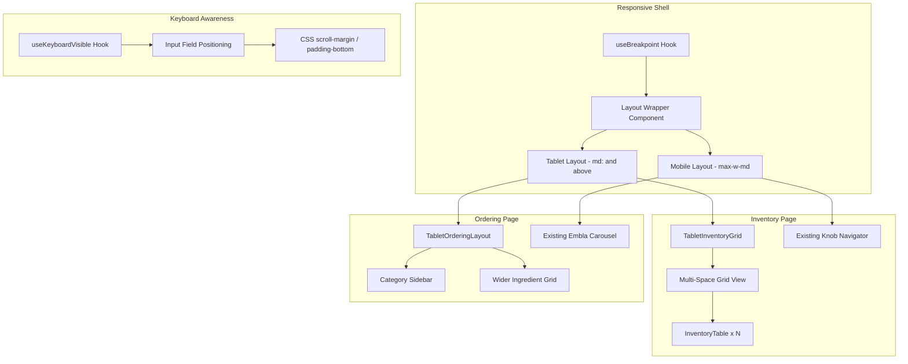
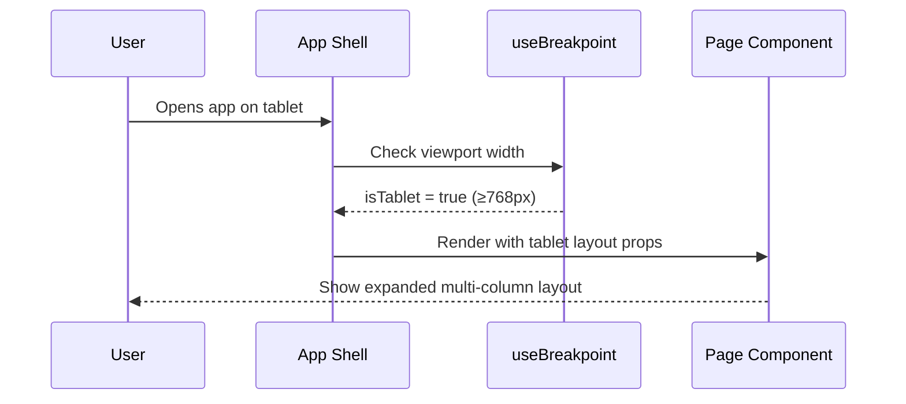
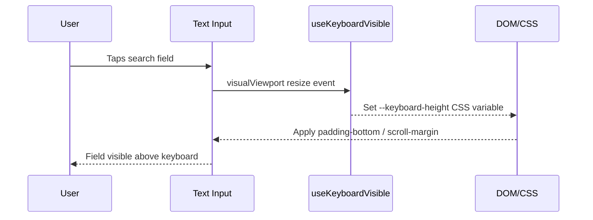

# Design Document: Responsive Tablet Layout

## Overview

This feature adds two capabilities to the kitchen management app: (1) keyboard-aware text fields that stay visible above the virtual keyboard on mobile devices, and (2) responsive tablet/desktop layouts that expand the currently mobile-constrained UI (`max-w-md`) to take advantage of wider screens. The inventory page will show multiple kitchen spaces simultaneously in a grid, and the ordering page will display a persistent category sidebar alongside a wider ingredient grid. All changes are additive — the existing mobile experience remains unchanged.

## Architecture



## Sequence Diagrams

### Tablet Layout Detection & Rendering



### Keyboard-Aware Input Flow



## Components and Interfaces

### Component 1: useBreakpoint Hook

**Purpose**: Provides reactive breakpoint state beyond the existing `useIsMobile` hook. Returns granular device class for layout decisions.

**Interface**:
```typescript
interface BreakpointState {
  isMobile: boolean;   // < 768px
  isTablet: boolean;   // >= 768px && < 1024px
  isDesktop: boolean;  // >= 1024px
  width: number;
}

function useBreakpoint(): BreakpointState
```

**Responsibilities**:
- Listen to `window.matchMedia` for `md` (768px) and `lg` (1024px) breakpoints
- Provide stable boolean flags for conditional rendering
- SSR-safe with undefined initial state

### Component 2: useKeyboardVisible Hook

**Purpose**: Detects virtual keyboard presence using the Visual Viewport API and exposes keyboard height for CSS adjustments.

**Interface**:
```typescript
interface KeyboardState {
  isKeyboardVisible: boolean;
  keyboardHeight: number;
}

function useKeyboardVisible(): KeyboardState
```

**Responsibilities**:
- Subscribe to `window.visualViewport.resize` events
- Calculate keyboard height as difference between `window.innerHeight` and `visualViewport.height`
- Set CSS custom property `--keyboard-inset` on document root
- Clean up listeners on unmount

### Component 3: TabletInventoryGrid

**Purpose**: Renders all 9 kitchen spaces in a responsive grid layout for tablet/desktop, replacing the knob-driven single-space navigator.

**Interface**:
```typescript
interface TabletInventoryGridProps {
  spaces: KitchenSpace[];
  onSpaceSelect?: (space: KitchenSpace) => void;
}

function TabletInventoryGrid({ spaces, onSpaceSelect }: TabletInventoryGridProps): JSX.Element
```

**Responsibilities**:
- Render a 3×3 CSS grid of `InventoryTable` components
- Each cell is independently scrollable
- Clicking a space header could expand it (optional future enhancement)
- Responsive: 2 columns on `md`, 3 columns on `lg`

### Component 4: TabletOrderingLayout

**Purpose**: Provides a sidebar + main content layout for the ordering page on tablets.

**Interface**:
```typescript
interface TabletOrderingLayoutProps {
  categories: Category[];
  activeCategory: string;
  onCategorySelect: (id: string) => void;
  alertCounts?: Record<string, number>;
  children: React.ReactNode;  // The ingredient grid content
}

function TabletOrderingLayout(props: TabletOrderingLayoutProps): JSX.Element
```

**Responsibilities**:
- Render a fixed-width category sidebar (left panel, ~200px)
- Main content area fills remaining width
- Ingredient grid uses 3-4 columns instead of 2
- Category sidebar replaces the horizontal scrolling `CategoryBar` on tablet

## Data Models

### CSS Custom Properties (added to `:root`)

```typescript
// Set dynamically by useKeyboardVisible
interface CSSCustomProperties {
  '--keyboard-inset': string;  // e.g., "300px" or "0px"
}
```

**Validation Rules**:
- `--keyboard-inset` must be a non-negative pixel value
- Falls back to `0px` when keyboard is not visible

### Breakpoint Constants

```typescript
const BREAKPOINTS = {
  sm: 640,
  md: 768,   // tablet starts here
  lg: 1024,  // desktop starts here
  xl: 1280,
} as const;
```

## Algorithmic Pseudocode

### Keyboard Height Detection Algorithm

```typescript
function calculateKeyboardHeight(): number {
  const viewport = window.visualViewport;
  if (!viewport) return 0;
  
  const windowHeight = window.innerHeight;
  const viewportHeight = viewport.height;
  const diff = windowHeight - viewportHeight;
  
  // Only consider it a keyboard if the difference is significant (> 100px)
  // to avoid false positives from browser chrome changes
  if (diff > 100) {
    return diff;
  }
  return 0;
}
```

**Preconditions:**
- `window.visualViewport` is available (supported in all modern mobile browsers)
- Called within a resize event handler

**Postconditions:**
- Returns 0 when no keyboard is visible
- Returns positive pixel value representing keyboard height when visible
- Never returns negative values

### Layout Selection Algorithm

```typescript
function selectLayout(width: number): 'mobile' | 'tablet' | 'desktop' {
  if (width >= BREAKPOINTS.lg) return 'desktop';
  if (width >= BREAKPOINTS.md) return 'tablet';
  return 'mobile';
}
```

**Preconditions:**
- `width` is a positive integer representing viewport width in pixels

**Postconditions:**
- Returns exactly one of the three layout modes
- Boundaries are inclusive on the lower end (768px = tablet, not mobile)

### Inventory Grid Column Calculation

```typescript
function getInventoryGridCols(layout: 'mobile' | 'tablet' | 'desktop'): number {
  switch (layout) {
    case 'desktop': return 3;  // Full 3x3 grid
    case 'tablet': return 2;   // 2 columns, scrollable
    case 'mobile': return 1;   // Single space with knob nav (existing)
  }
}
```

**Preconditions:**
- `layout` is a valid layout mode string

**Postconditions:**
- Returns column count appropriate for the viewport
- Mobile always returns 1 (preserves existing knob navigation)

## Key Functions with Formal Specifications

### useKeyboardVisible()

```typescript
function useKeyboardVisible(): KeyboardState
```

**Preconditions:**
- Component is mounted in a browser environment
- `window.visualViewport` exists (graceful fallback if not)

**Postconditions:**
- `isKeyboardVisible` is `true` if and only if calculated keyboard height > 100px
- `keyboardHeight` equals the pixel difference between window and viewport height
- CSS variable `--keyboard-inset` is set on `document.documentElement`
- Cleanup removes all event listeners on unmount

**Loop Invariants:** N/A (event-driven, no loops)

### useBreakpoint()

```typescript
function useBreakpoint(): BreakpointState
```

**Preconditions:**
- Component is mounted in a browser environment

**Postconditions:**
- Exactly one of `isMobile`, `isTablet`, `isDesktop` is true at any time
- `width` reflects current `window.innerWidth`
- State updates synchronously with viewport changes via `matchMedia`

**Loop Invariants:** N/A

## Example Usage

### Keyboard-Aware Input in IngredientWizard

```typescript
// In IngredientWizard.tsx - the search input at the bottom
import { useKeyboardVisible } from '@/hooks/useKeyboardVisible';

function IngredientWizard({ spaceId, onSelect, onCancel }: IngredientWizardProps) {
  const { isKeyboardVisible, keyboardHeight } = useKeyboardVisible();

  return (
    <div className="absolute inset-0 flex flex-col bg-card overflow-hidden">
      {/* ... existing content ... */}
      
      {/* Bottom search - pushed above keyboard */}
      <div 
        className="border-t border-border/50 bg-card shrink-0 transition-[padding] duration-200"
        style={{ paddingBottom: isKeyboardVisible ? `${keyboardHeight}px` : undefined }}
      >
        <input ref={searchRef} type="text" ... />
      </div>
    </div>
  );
}
```

### Tablet Inventory Page

```typescript
// In Inventory.tsx
import { useBreakpoint } from '@/hooks/useBreakpoint';
import { TabletInventoryGrid } from '@/components/inventory/TabletInventoryGrid';

const Inventory = () => {
  const { isMobile } = useBreakpoint();

  if (!isMobile) {
    return (
      <div className="min-h-screen bg-background max-w-6xl mx-auto">
        <header>...</header>
        <TabletInventoryGrid spaces={KITCHEN_SPACES} />
      </div>
    );
  }

  // Existing mobile knob-driven layout
  return (
    <div className="min-h-screen bg-background max-w-md mx-auto ...">
      {/* existing code unchanged */}
    </div>
  );
};
```

### Tablet Ordering Page

```typescript
// In Index.tsx (ordering page)
import { useBreakpoint } from '@/hooks/useBreakpoint';

const Index = () => {
  const { isMobile } = useBreakpoint();

  return (
    <div className={cn(
      "min-h-screen bg-background relative flex flex-col",
      isMobile ? "max-w-md mx-auto" : "max-w-5xl mx-auto"
    )}>
      {/* Header stays full-width */}
      <header>...</header>

      {isMobile ? (
        // Existing embla carousel layout
        <div className="flex-1 overflow-hidden" ref={emblaRef}>...</div>
      ) : (
        // Tablet: sidebar + grid
        <div className="flex-1 flex overflow-hidden">
          <aside className="w-52 border-r border-border overflow-y-auto">
            {/* Vertical category list */}
          </aside>
          <main className="flex-1 overflow-y-auto">
            {/* 3-4 column ingredient grid */}
            <div className="grid grid-cols-3 lg:grid-cols-4 gap-2 p-4">
              {filtered.map(ingredient => <IngredientCard ... />)}
            </div>
          </main>
        </div>
      )}
    </div>
  );
};
```

## Correctness Properties

1. **∀ viewport width w**: `selectLayout(w)` returns exactly one layout mode — mobile, tablet, or desktop are mutually exclusive.

2. **∀ keyboard event**: When `visualViewport.height < window.innerHeight - 100`, `isKeyboardVisible === true` and `keyboardHeight > 0`.

3. **∀ input field with keyboard-aware behavior**: When keyboard is visible, the input's bottom edge is above the keyboard's top edge (field is not occluded).

4. **∀ tablet viewport (w ≥ 768)**: The inventory page renders multiple `InventoryTable` instances simultaneously (count > 1).

5. **∀ mobile viewport (w < 768)**: The existing knob-driven navigation and embla carousel remain the active layout — no tablet components are rendered.

6. **∀ resize event**: Layout transitions between mobile ↔ tablet are seamless with no content loss or state reset.

7. **∀ InventoryTable in tablet grid**: Each table instance maintains independent scroll position and data state.

## Error Handling

### Error Scenario 1: Visual Viewport API Unavailable

**Condition**: Older browsers or desktop browsers where `window.visualViewport` is undefined
**Response**: `useKeyboardVisible` returns `{ isKeyboardVisible: false, keyboardHeight: 0 }` — no padding adjustments applied
**Recovery**: Graceful degradation; inputs behave as they do today (no keyboard awareness)

### Error Scenario 2: Rapid Viewport Resizing

**Condition**: User rotates device or resizes browser window rapidly
**Response**: Debounce layout recalculation (100ms) to prevent layout thrashing
**Recovery**: Final stable viewport size determines layout; intermediate states are skipped

### Error Scenario 3: Tablet Grid with Slow Network

**Condition**: Multiple InventoryTable components loading data simultaneously on tablet
**Response**: Each table shows its own skeleton loader independently
**Recovery**: Tables render as data arrives; no blocking between spaces

## Testing Strategy

### Unit Testing Approach

- Test `useBreakpoint` hook with mocked `matchMedia` at various widths
- Test `useKeyboardVisible` with mocked `visualViewport` events
- Test `selectLayout` and `getInventoryGridCols` pure functions
- Verify CSS variable is set/unset correctly

### Property-Based Testing Approach

**Property Test Library**: fast-check

- Property: For any viewport width, exactly one layout mode is active
- Property: Keyboard height is always non-negative
- Property: Grid column count is always ≥ 1 and ≤ 3

### Integration Testing Approach

- Render Inventory page at 1024px width → verify multiple InventoryTable instances in DOM
- Render Inventory page at 375px width → verify single InventoryTable with knob navigation
- Render ordering page at 768px → verify sidebar is present and carousel is absent
- Simulate keyboard open → verify input padding increases

## Performance Considerations

- **Lazy mounting**: On tablet inventory grid, only mount InventoryTable components that are in viewport (or all 9 since they're small)
- **No re-renders on resize**: Use CSS breakpoints (`md:`, `lg:`) for purely visual changes; only use JS breakpoint hook for conditional rendering of entirely different component trees
- **Keyboard detection**: Use passive event listeners on `visualViewport` to avoid blocking scroll
- **Embla carousel**: Only instantiated on mobile; tablet layout uses static grid (no carousel overhead)

## Security Considerations

No security implications — this feature is purely presentational/layout changes with no new data flows, API calls, or user input handling beyond what already exists.

## Dependencies

- **Existing**: Tailwind CSS responsive utilities (`md:`, `lg:`, `xl:`)
- **Existing**: `window.visualViewport` API (supported in iOS Safari 13+, Chrome 61+, Firefox 91+)
- **Existing**: React state management (no new libraries needed)
- **No new dependencies required** — all responsive behavior is achievable with Tailwind breakpoints and native browser APIs
